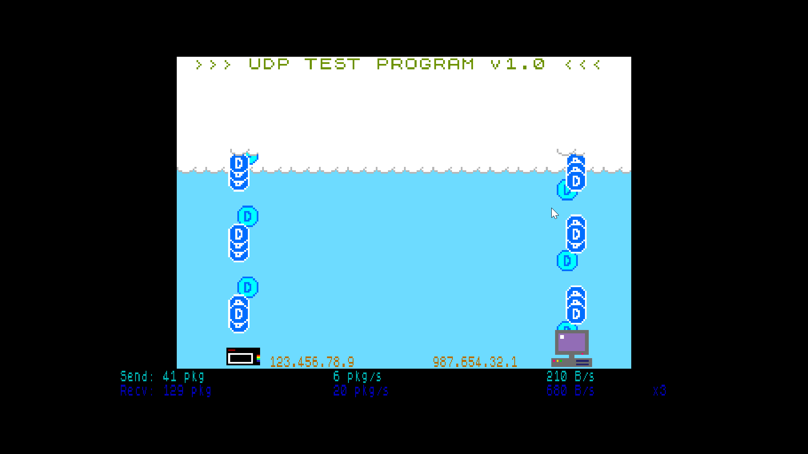

# The UDP test program

## A short explanation of what the program does

The program sends UDP packets to the UDP server (hosted in PC). The packet is a special test packet which the UDP server understands and it sends the actual payload data back as many times as requested in the packet header data. This mimics the situation where there are several clients. The packets are send every 8th frame (about 6 times a second at 50 hz frame refresh). One UDP packet is received on every frame.

The graphics in the program are partly informing about the real usage and partly only for the viewing pleasure. E.g. for receiving, the (blue) packet sprite animation *is launched* each time the real UDP packet is received (supposing there is a free sprite to do that). The animation duration has nothing to do with the UDP communication thought. The same is true with outgoing (to the server) data packets. 

## Usage

0) Preconditions: 
   	- You need to have your Wifi connection set up. You can do this from the Next main menu: "more../tools/Wifi Setup". Look at the Spectrum Next manual (!!) if you need more information about using the Wifi startup. 
	- Also you need to copy the NxtUdpTest.nex to the Next SD card. Copy it under the folder "Home".

1) Find out the server (PC) ip address. There are multiple ways to do it:
	- E.g. give in the commmand prompt in PC: "ipconfig" (Windows) or "ifconfig" (Linux) 
	- You can do also that by starting the simple-udp-server.py (as instructed in the phase (3) ) but *without any parameters*. Remember to kill the python program with ctrl-c after that.

2) You can now start the UDP client in Next. 
	2.1) Easiest way to do it is using the Browser. Go to the "Home" directory and launch NxtUdpTest.
	2.2) The first time you launch the programs, you are asked the give server ip address.
	You can now see the packet going from Next to PC, but PC is not yet ready to receive and sent them back.
	Note: If you want to re-enter the ip address later, just remove the config file (NxtUdpTest.cfg) and it will be asked again.

3) Now you can start the UDP server in PC.
   	- Install Python (I used Python 3.9) if not already installed.
   	- Start the server with the command:  python3.9 simple-udp-server.py -c 123.456.78.9
    - The IP address after "-c" is the client IP address you can see in the Next program, on the right side of the Next device picture.

Now you should see the packets running forth and back between the server in PC and the client in Next :-)

There are 3 keys that affect to functionality:
- "1": The program sends one packet and the server sends it back
- "2": The program sends one packet and the server sends 3 packets back
- "3": The program sends one packet and the server sends 7 packets back

The numeric data in the bottom of the screen is as follows. 
The first row:
- The total UDP packets send to the server.
- The packets sent per second
- The bytes sent per second (each packet has a 19 byte header and a 32 byte payload data). 

The second row:
- The total UDP packets received from the server.
- The packets received per second
- The bytes received per second (each packet has a 2 byte header and a 32 byte payload data).  
- The number of packets the server sends back for each received packet (meaning how many pseudo clients there are in addition to my client)

## Security

You should have your normal secure firewall and security settings enabled in PC. 
Both the client (Next) and server (PC) are checking the IP address where the packet came from. If either end detects a packet that came from an unknown address it will fail the program immediately. That is ok for a simple test application like this. For advanced security, you can in firewall only allow IP connections to the server port 4444 from the Next ip address. That way you can block connections from unknown ip addresses before they are even delivered to the server application.  

## Visible memory map (64k address space)

$8184: CODE
	- e.g. driver_terminal_input, driver_terminal_output, stdio
	- my program code

$C06C-$CCE6: COMPILER RODATA
	- e.g. $C2D5: _cloudSpr
		
$CDC3-$CE37: COMPILER DATA
	- e.g. CDFB: _totalSendPacketCount

$CE3B- $D251: COMPILER BSS (uninitialized data)
	e.g.
	- CE3B: _incomingPacketGobs 
	- CEEF: _outgoingPacketGobs 

$FD58-$FF58: STACK
	- $FF58: TAR__register_sp
	- stack size: $200

## Memory banks (16kb each)
$0000-$3fff: L2 buffer / rom                        => rom bank / layer 2
$4000-$7fff: ???          							=> bank 5
$8000-$bfff: code, data, free ram 					=> bank 2
$c000-$ffff: ????, stack                           	=> bank 0

## Layer2 buffers
Layer2 main buffer                                  => bank 8
Layer2 shadow buffer                                => bank 11		

# Features used

*Note: As this is my first Spectrum program ever there might some pecularities or lurking errors in the code.*

Below is a list of some of the features used in the program. I hope you find it useful in your own C program.

- Uses two libraries for easy access to graphics: zxnext_Layer2 and zxnext_sprite
- Uses the tilemap layer for implementing texts. The font bitmap data is copied from ROM to the area accessible by the tilemap.
- A IM2 interrupt handler in C which updates an own frame counter.
- Uses ESP8266 via UART
- Uses UDP communication (via ESP) with the server.
- Calculates the current stack usage in the program (GetUsedStack()).
- Implementes a very simple UDP server in Python.
- Adding a programmatic breakpoint in the C-code for CSpect emulator (CSPECT_BREAK_IF())

# Lessons learned
This is my first Spectrum or Spectrum Next program ever, so obiously there has been *really a lot* to learn.
Here are the list of new things I have learned as I remember:

1) Setup the development environment: Z88DK, VCCode, CSpect with integrated debugger (Z88DKSPECT.EXE for converting the map file for the debugger).
2) Using the ESP8266 dongle in PC for CSpect to enable networking. AT commands was a new to me also. TeraTerm was used to study AT commands before implementing them in the program.
3) NextSync for transfering program to Next HW for testing.
4) I used zxnext_Layer2 and zxnext_sprite libraries for gfx in the program.
5) Created a text tilemap layer for printing text efficiently over the L2 layer.
6) Making sprite texture data using Gimp, gfx2next.exe and my custom python script for converting *.nxi to C array.
7) Segmented memory, banks, stack and program start addresses, etc. This is still in process as I do not need much memory for this UPD test program, but in the future I will. 

And, of course, the beautiful Spectrum Next device itself, which I was lucky enough to be able to purchase for Christmas 2024! There is so much to learn still in many aspects of the device and the system SW. Also, I have only scratched the surface of the game gallery of Next and the original Spectrum :-) 

In the learning process, the Specturm Next discord community has been a priceless help. There are very professional, helpful and enthusiastic people, and without them this would have taken much much more than a month, from zero to a working program ! 

# Next steps

The UDP test program v1 is ready but I plan to do more:
- Add and check the sequence numbers so that it can be checked that packets are not lost. 
- Optimize and measure the time (raster lines) the UDP comminication takes. This gives a hint how many cycles are left for the game. 